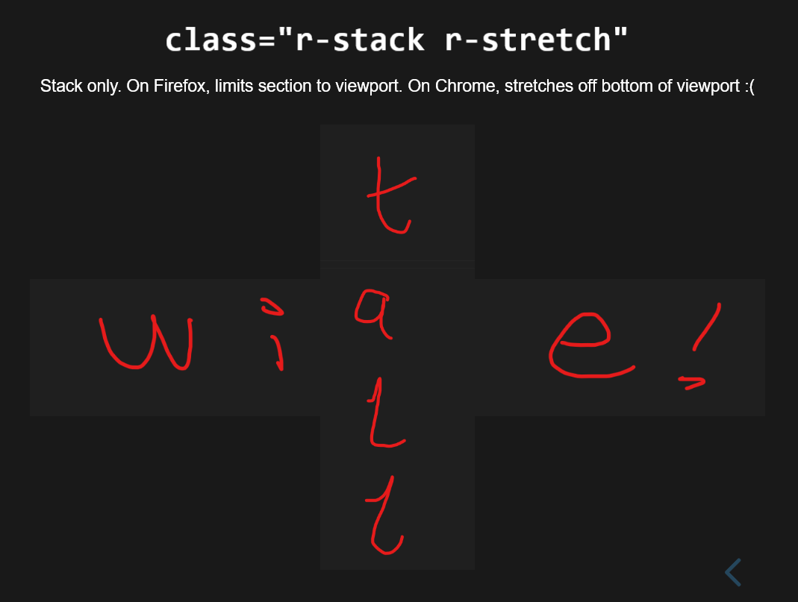
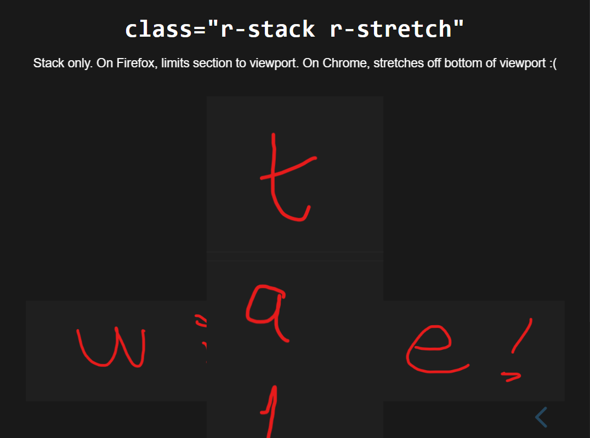

# `RevealJS` stacking and stretching

Bug reproduction. Fixed by <https://github.com/hakimel/reveal.js/pull/3598>

See `index.html` on <https://alifeee.co.uk/revealjs-rstretch-bug>. The images stretch and stack correctly in Firefox, but not Chrome

## In Firefox

## In Chrome

